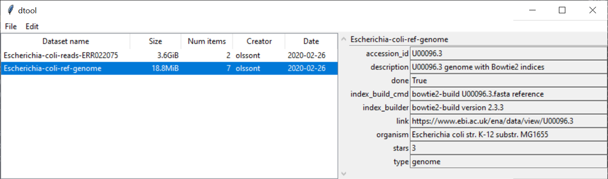
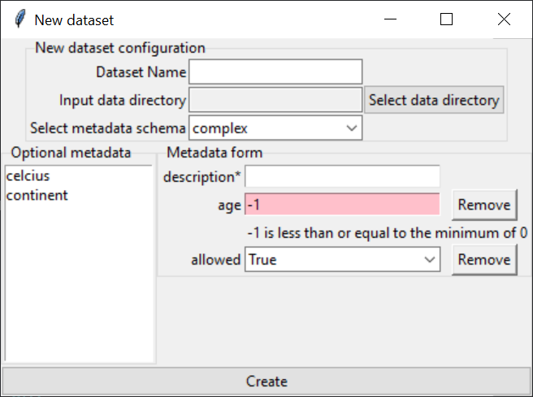

dtool-tk: a graphical user interface for managing data using dtool
==================================================================

Installation
------------

::

    python setup.py install

Usage
-----

To start the application run the command::

    dtool-tk

When the application starts for the first time the user will be asked to
specify a directory to use as the "local base URI directory". This is the
location where the application will look for existing datasets and save new
datasets to. The local base URI directory can be set and updated using the
"Edit >> Edit preferences..." dialogue.

Existing datasets are displayed on the left hand side of the main window.
Information about a selected dataset is available on the right hand side
of the main window.

   The main window of the dtool-tk GUI

When creating a new dataset one has to specify the name and the input directory
from where the data files will be copied. One also needs to specify the
metadata schema to use to describe the metadata. 

Metadata schemas are described using a subset of the `JSON schema
<https://json-schema.org>`_ syntax. The dtool-tk application comes with one
basic schema built in:

.. code-block:: json

    {
      "type": "object",
      "properties": {
         "description": {"type": "string"}
      },
      "required": ["description"]
    }

More metadata schemas can be added by creating approprate JSON files in the
user's ``~/.config/dtool/metadata_schemas`` directory. Below is an example
of a more complex metadata schema:

.. code-block:: json

    {
      "type": "object",
      "properties": {
         "description": {"type": "string", "minLength": 3, "maxLenth": 80},
         "age": {"type": "integer", "exclusiveMinimum": 0},
         "allowed": {"type": "boolean"},
         "celcius": {"type": "number", "exclusiveMinimum": -273.15},
         "continent": {
            "type": "string", 
            "enum": [
              "Africa",
              "Antarctica",
              "Asia",
              "Europe",
              "North America", 
              "South America"
            ]
         }
      },
      "required": ["description"]
    }

   The "New dataset" window of dtool-tk, using a more "complex" metadata
   schema. The optional metadata items "age" and "allowed" have been
   selected. Feedback is provided if the metadata entered does not conform to
   the specification in the schema as in the case of having an "age" less than
   or equal to 0.

Shortcuts
---------

==================  ============= =======
Description         Windows/Linux Mac OSX
==================  ============= =======
Create new dataset  Ctrl+N        Cmd+N
Edit metadata       Ctrl+M        Cmd+M
Edit preferences    Ctrl+P        Cmd+,
Quit                Ctrl+Q        Cmd+Q
==================  ============= =======
